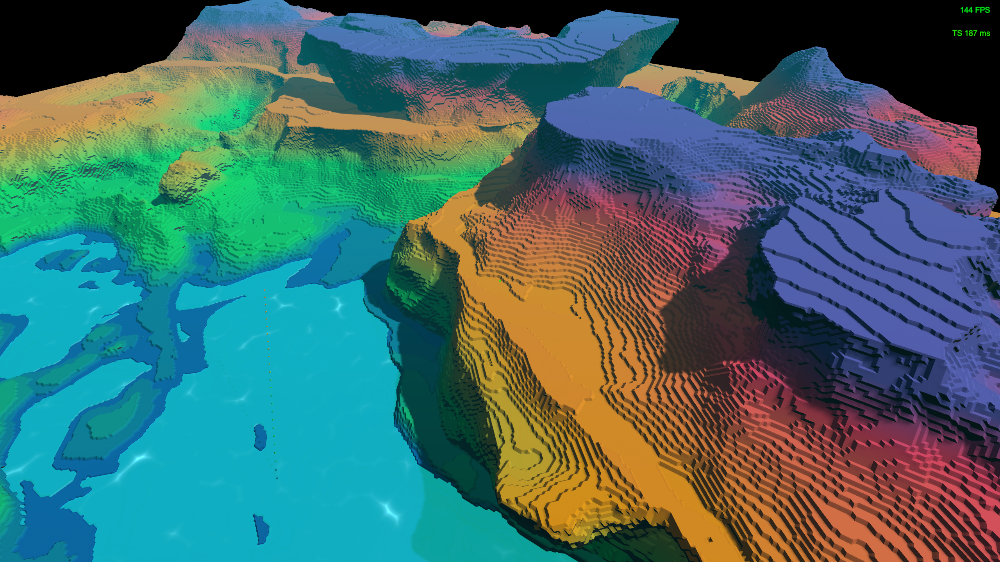
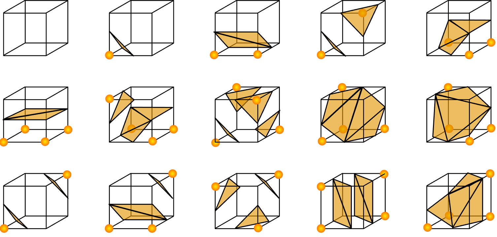
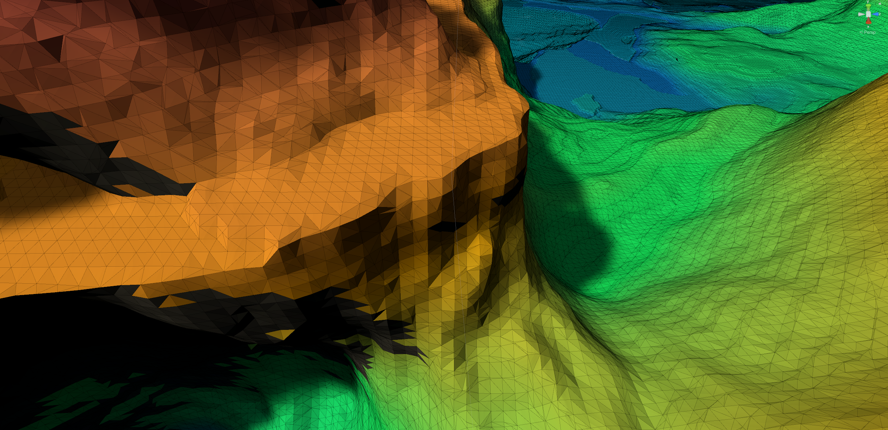

### Download Link ###

> Windows 64 smooth: <a href = https://github.com/FzComet206/Project-Terraces/releases/download/Experiment/Build.zip> An experimental world prototype smooth </a>
> 
> Windows 64 Blocky: <a href = https://github.com/FzComet206/Project-Terraces/releases/download/ExperimentBlocky/Project.Terraces.Blocky.zip> An experimental world prototype blocky </a>

### Controls ###

> Move: W A S D Shift Space

> Toggle Brush: F

> Change Brush: C

> Apply Brush: left click

> Undo Brush: right click

> Quit Applicaiton: Q

 

---
---
# Project Terraces

#### Hi, this is my second major Unity project called Project Terraces. This is a sandbox that features the following topics: 
	
- Infinite Chunk based terrain generation
- Chunk based mesh culling
- GPU (Compute Shader) based Marching Cubes algorithm
- Brush Like feature (4 brushes) that can modify terrains in realtime
- Multithreaded CPU based simple voxel fluid (like water in minecraft)
- 3D Simplex Noise and various noise manipulation methods:

	- Domain Wraping

	- Fractal Brownian Motion

	- Modulo operations on 3D noise which yield terraces like terrain

---

### Infinite Chunk based terrain generation and Chunk Culling

This project features procedurally generated mesh/chunks (infinit) and a bit of chunk culling.

The procedural generation works by taking the position of the camera/player, and find out nearby fixed chunk coordiates. Each unique chunk is generated alone with it's meshes and stored in a datastructure. The process of generating chunks uses a corountine so it doesn't block the main thread.

The chunk culling works by taking the position of the camera/player and then delete chunks that are too far away. The culling works only if a number of chunks is already generated. 

Deleted chunks can be regenerated by getting the camera/player closer to it. If the terrain is modified by a brush, it will not be stored since i haven't implemented a storage feature.

---

### Marching Cubes on GPU

The project uses Marching Cubes as its meshing algorithms. Marching cubes works with voxel based data (eg. 3D grid represented by 1D array). 

In order to use Marching Cubes. We have to specify the density values of each of the eight corners of the cube, and a threshold. If the value of the node is above that threshold, it will be considered as an air node. Otherwise, the node will be considered as a ground node (can flip around as long as it's consistent). 

Given eight nodes that is either air or ground node, we can then use that configuration, which is 1 out of 256, to construct a cube (cube here is a abstract concept). To construct a surface, we simply draw out every triangles of each cube procedurally and feed it to GPU (the coding part is not simple at all).

To draw a triangle, we need three verticies that is represented by three vectors in an array called vertex buffer. We then need an index buffer (or triangle buffer) to poke into that vertex buffer. The process of procedurally generate index buffers can be called triangulation.

With these two buffers, we can visualize the mesh with Unity's own APIs. We can also use other graphical APIs like Vulkan, OpenGL, and Directx, but that would be way more difficult and time consuming as it requires building our own render pipelines and obsessively coding with c++.

Above image taken from Wikipedia

---

### Brushes and how it works

insert video here

---

### Simple Voxel fluids

insert videos here

---

### Forging Simplex Noises

insert images here

---

### Remark

insert GIF here

At the time i write this blog, this project has already been finished for 6 months. Revisiting my code, there are definitely quite a lot of spaces for improvement. Here are the potential problems in the project:

- Marching cubes on GPU might be unnacessary since the vertex and index buffers are required to be read back and unpacked by the cpu. Because of this, cpu bottlenecks the mesh generation process for each frame, thus underminining the efficiency of Compute Shader.

- Voxel based simple fluid flow in this game are too unrealistic (not as good as the ones in minecraft). FLuid also takes too much cpu time and memory to process, so there needs to be alternative solutions.

- Current chunks are 16x16x256, this could be changed to 16x16x16, and the maximum height of the terrains should be higher when i stack chunks on top of each other.

- more consistent and less laggy brushes.

In the future, i plan to rework on this project and make it look more like a complete sandbox, or even a game. Here are the potential features that i am considering:

- small scale volumetric rendering such as fog or clouds

- atmospheres and day/night cycles

- procedurally animated creatures

- some character mechanics and better UI

